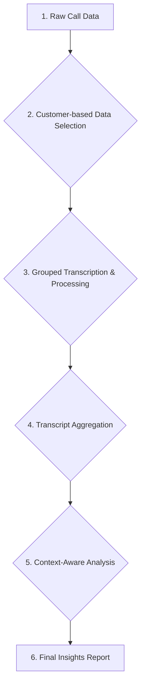

# Customer Journey Analysis Pipeline (v3)

## 1. Overview

This document outlines an enhanced pipeline architecture focused on analyzing the complete call history for a sample of customers. This "customer journey" approach will provide a more holistic and contextually aware analysis of the sales process.

## 2. Core Principles

*   **Customer-centric Analysis**: The unit of analysis is a customer (represented by a unique phone number), not an individual call.
*   **Context-Awareness**: The final analysis will be informed by a detailed understanding of the specific sales strategy being employed (e.g., the "gatekeeper strategy").
*   **Modularity & Reusability**: We will continue to leverage the modular components of our existing pipeline, adapting them to this new, customer-centric workflow.

## 3. Revised Pipeline Flow

### Component Breakdown

1.  **Raw Call Data**: The original CSV files containing all call records.
2.  **Customer-based Data Selection**: A revised script (`1_select_customers.py`) that will:
    *   Identify all unique phone numbers.
    *   Select a representative sample of ~100 phone numbers based on the proportional distribution of call frequencies.
    *   Gather *all* recording URLs for each selected phone number.
3.  **Grouped Transcription & Processing**: The main pipeline orchestrator (`run_journey_pipeline.py`) will be adapted to:
    *   Process all recordings for a given phone number in a single batch.
    *   Save the processed transcripts in a structured way that preserves the customer grouping (e.g., `output/customer_journeys/[phone_number]/[transcript].json`).
4.  **Transcript Aggregation**: A new script (`7_aggregate_transcripts.py`) will:
    *   Read all the processed transcripts for each customer.
    *   "Squish" them together into a single, chronologically ordered document that represents the complete customer journey.
5.  **Context-Aware Analysis**: The final analysis script (`8_analyze_journeys.py`) will be updated to:
    *   Use a new, context-aware prompt (`prompts/analyze_journey.txt`) that includes the details of the "gatekeeper strategy."
    *   Run the analysis on the aggregated "squished" transcripts.
6.  **Final Insights Report**: The output of the analysis script, providing a rich, contextually aware summary of the sales process for each customer journey.

This revised architecture represents a significant upgrade to our analytical capabilities, moving from single-call analysis to a more powerful, narrative-driven approach.

How does this new architectural plan look to you?